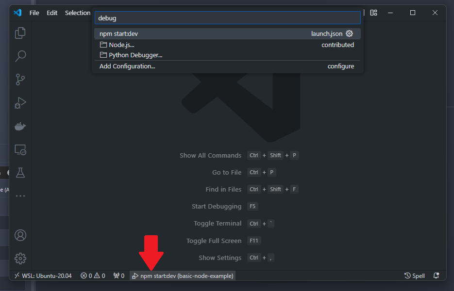
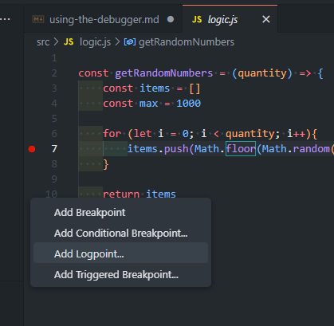
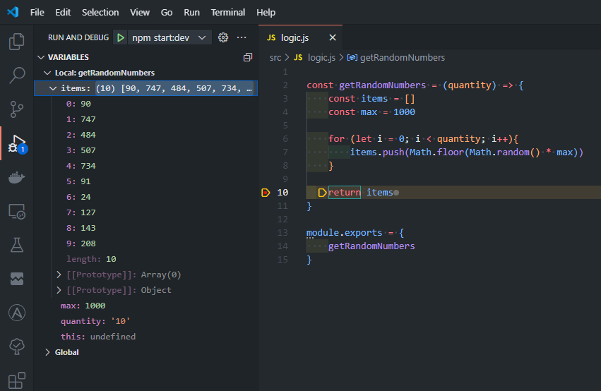

# Using the Debugger

This documentation is a continuation of looking at this article:

https://code.visualstudio.com/docs/editor/debugging

## Launching from Main

At the bottom of the VS Code window, there's an option to spawn the debugger or the various launch configurations that have been set up.  This can be nice if you don't want to open the "Run and Debug" view.

## Debugger Control

### Controlling the Debugger

| Action | Explanation |
| --- | --- |
| F5 | `Continue` execution up to the next breakpoint. Or `Pause` on current line. |
| F10 | Step Over |
| F11 | Step Into |
| Shift+F11 | Step Out |
| Ctrl+Shift+F5 | Restart |
| Shift+F5 | Stop |

## Point Setting
| Action | Explanation |
| --- | --- |
| F9 | `Enable` or `Disable` a breakpoint at the current line. |

A log point can be set by right clicking!  This is nice for when you can't edit the code like for a production server.

## Data Inspection

Data can be inspected when code is paused on the left sidebar.

