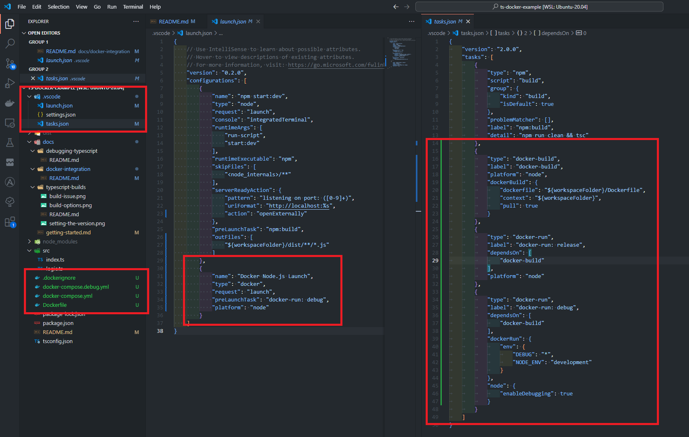

# Docker Integration

This document explains how to integrate VS Code tasks and the debugger with Docker (and Typescript).

This documentation takes the best parts from a few articles and includes my reflections.

https://code.visualstudio.com/docs/containers/quickstart-node

https://code.visualstudio.com/docs/containers/debug-node

https://code.visualstudio.com/docs/containers/debug-common

https://code.visualstudio.com/docs/containers/docker-compose

## Initial Investigation

Before integrating with Docker, I first wanted to see how the VS Code tools work to automatically generate content in this area.  I started by following the `quickstart-node` guide above, opened the command palette, and ran `Docker: Add Docker Files to Workspace...`.  

This generated a lot of content.  See image below:

Here is what was generated

- `.dockerignore` - this looks great! I definitely want to use this
- `Dockerfile` - This will need some adjusting.  
  - It needs to support Typescript!
  - It seems like only production `dependencies` are installed, which seems odd given the need for `devDependencies` for the dev runtime.
- `docker-compose` - I really like how it created two files (`docker-compose.debug.yml` and `docker-compose.yml`) to create two separate run-times - one for debugging, and one to demonstrate a production runtime.
  - This should be adjusted to respect two separate `Dockerfile` 
- `tasks.json` - Three tasks got created here
  - `docker-build` - this makes perfect sense - build the image!
  - `docker-run: release` - this also seems good, and it depends on `docker-build`.  Basically just runs the container as is with no `ARGS`
  - `docker-run: debug` - this is just like the previous, but adds `DEBUG: *` and `NODE_ENV: development` among a few other things.
- `launch.json` - This one is interesting as its a launch command, but it effectively just runs the task `docker-run: debug` defined in `tasks.json`
- other:
  - I noticed it generated docker-compose files, but no launch or task configuration to run them.

# Reworking the Autogenerated Code

This auto-generated code feels like a good starting point, but I want to adjust it to make it work better with Typescript and be a little more efficient, leveraging multi-stage builds.

