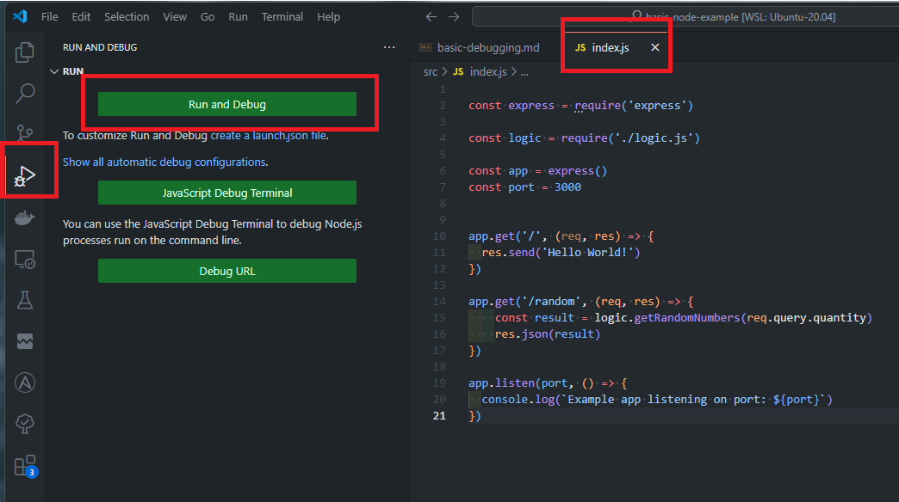
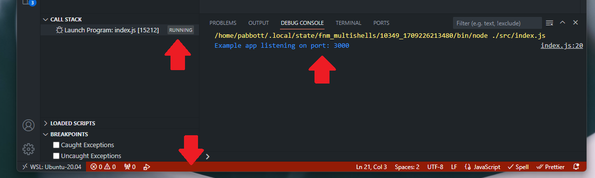
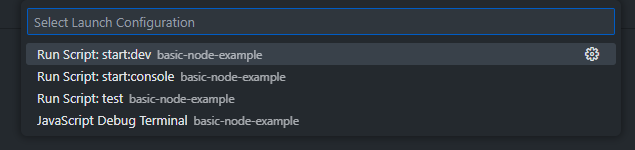
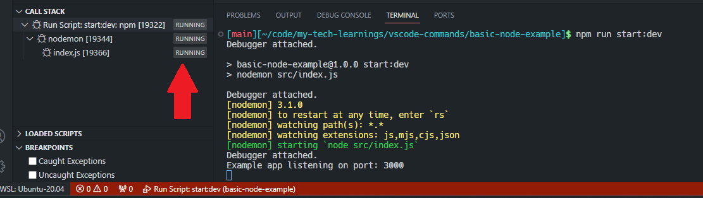
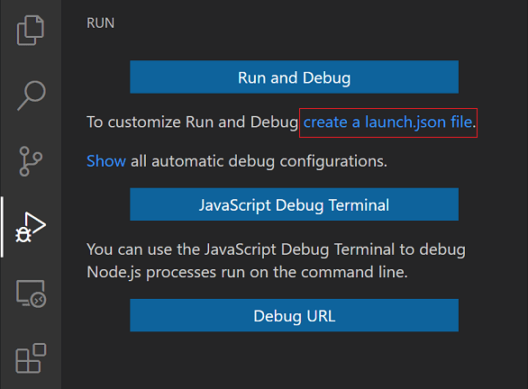
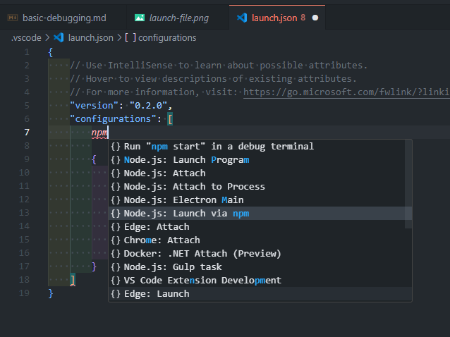

# Basic Node.js Debugging

This document explains some basics of how to use the VS Code debugger.  

This documentation is meant to pick out the best parts from this guide:
https://code.visualstudio.com/docs/editor/debugging

## Simple & Temporary Configurations

With the index.js file open, click on the "Run & Debug" menu.  



This will make VS Code go into Debug mode which is shown by the red bar at the bottom of the screen.

It seems VS Code just runs `node` against the given file, and then monitors the newly created process.



Another way to set up a quick configuration is to use the link that reads: `Show all automatic debug configurations.`  This is great as it detects what is going on in the `package.json`



With this configuration, we now get to operate within the host machine's terminal, and the call stack is a bit bigger as the process is wrapped by nodemon (see below).



## Set up a config file

Instead of using temporary configurations, I'm now interested in one that will be more permanent and that I can share with my team.



The default configuration for Node.js is simply a way to run a single file, and it uses the `"${file}"` designation so it really just runs whichever file you have open.  This is less than ideal, as I'm interested to leverage the `start:dev` command.

It seems a new configuration can be added by using the top-level `Run` menu and selecting `Add Configuration...` I started typing `npm` to get the following:



My configuration is a `launch` request which is meant to create a new process.

```json
"configurations": [
{
    "name": "npm start:dev",
    "request": "launch",
    "runtimeArgs": [
        "run-script",
        "start:dev"
    ],
    "runtimeExecutable": "npm",
    "skipFiles": [
        "<node_internals>/**"
    ],
    "type": "node"
}]
```

Now that a launch configuration is set up, I can run the program in debug mode with `F5` - This is cool! One button to spin up my program!


The full set of options for configuration is here:

https://code.visualstudio.com/docs/editor/debugging#_launchjson-attributes
