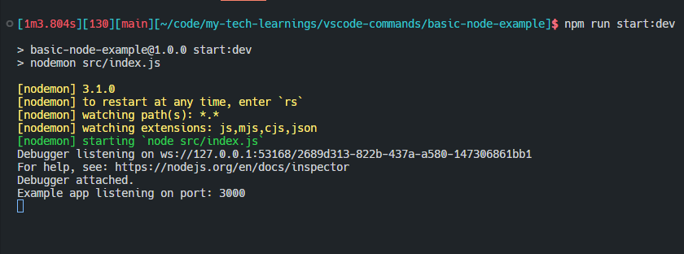

# Node.js Debugging

This document is meant to highlight the best parts of this official documentation:

https://code.visualstudio.com/docs/nodejs/nodejs-debugging

## Auto Attach

Auto attach can automatically attach your debugger if you start your program from the terminal.  This seems like it could be helpful.  If I'm starting an application in development mode, perhaps I would always want a debugger for that situation.  Perhaps this could help with forming new habits of actually using the debugger every time?

Setting this feature can be done via `CTRL+SHIFT+P` and then typing `auto attach`.

I set mine to `smart` which set VS Code into debug mode when i ran `npm run start:dev`



Note:  I can also have the `F5` experience start the app in an integrated console with this setting for consistency!

```json
"console": "integratedTerminal",
```

## Launch Configuration

There are a lof of attributes for launch configuration!

https://code.visualstudio.com/docs/nodejs/nodejs-debugging#_launch-configuration-attributes

Here are some of the interesting ones

| Attribute | Description | Possible Use |
| --- | --- | --- |
| `outFiles` | array of glob patterns for locating generated JavaScript files. | source maps! There's a whole section on this. |
| `timeout` | give up after this many ms | ideally i don't have to use this one. |
| `localRoot` / `remoteRoot` | VS code and Node's root directory | remote debugging |
| `smartStep` |  try to automatically step over code that doesn't map to source files | This feels like a huge quality of life setting |
| `env` / `envFile` | optional environment variables | scripted dev env? |
| `cwd` | current working directory | this could be interesting for a monorepo...? |

## Attaching to Node.js 

If you want to attach to node, then there are basically two options:
1. Use `launch.json` configuration with `type: attach`
1. Run `node --inspect program.js` and then `CTRL+SHIFT+P` and then `Attach to Node Process`

## Stop debugging

Easy! Just click the stop button.  With auto attach, a `CTRL+C` in the terminal will also stop things.  Very cool that the IDE stays in sync!

## Skipping uninteresting code

There's no need to pick up exceptions or debug external code or compiled stuff.

```json
  "skipFiles": [
    "${workspaceFolder}/node_modules/**/*.js",
    "${workspaceFolder}/lib/**/*.js"
  ]
```

This bit can also exclude all of the node.js internals

```json
 "skipFiles": [
     "<node_internals>/**/*.js"
   ]
```

