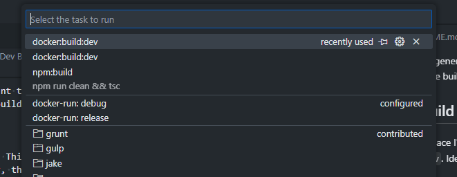
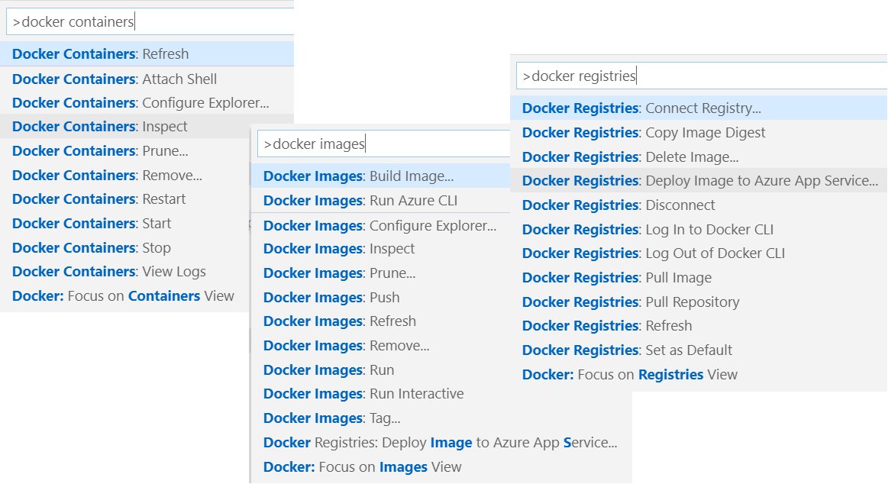
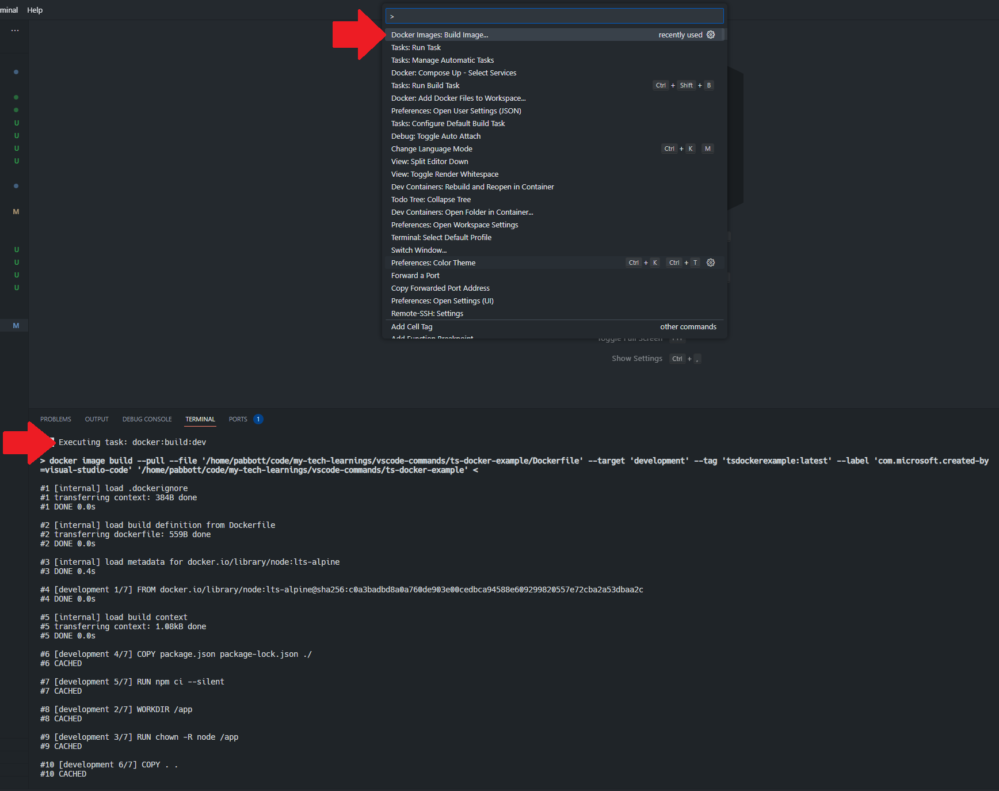
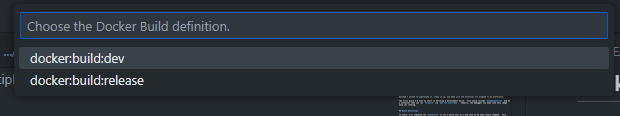

# Basic docker build

After generating a bunch of code via the document: [Docker Integration](../docker-integration/README.md), I decided I wanted to understand it, clean it up, and make sure the workflows are aligned to my preference.

The first place I'd like to start is defining a development build.  This would include `devDependencies` and be a container that can run `ts-watch` via `npm run start:dev`.  Ideally, the debugger can hook into this image once its running.


## Build Definition

To start, I'll redefine the `Dockerfile` to run a build just as I did with my VS Code launch command.  This will be useful as I'll be able to reference the optimized build later in a production stage.

```Dockerfile
FROM node:lts-alpine as development

WORKDIR /app
EXPOSE 3000
RUN chown -R node /app
USER node

COPY package.json package-lock.json ./

ENV NODE_ENV=development
RUN npm ci --silent

COPY . .

RUN npm run build

CMD ["npm", "start:dev"]
```

And then set up a build task in `tasks.json` -- Since we know we're going with a multi-stage build, we need to set the target stage.

```json
{
    "type": "docker-build",
    "label": "docker:build:dev",
    "platform": "node",
    "group": {
        "kind": "build",
    },
    "dockerBuild": {
        "dockerfile": "${workspaceFolder}/Dockerfile",
        "target": "development",
        "context": "${workspaceFolder}",
        "pull": true
    }
},
```
## Initiate a Build
To run this build configuration, I have a few options it seems.  The first is to execute just any of my tasks by opening the command palette and choosing `Tasks: Run Task` -- This item is easy to find by just typing the word `task`.  See task options below



Alternatively, I can make sure there is no default build task by removing the `isDefault` designation from the other build task.  This means I can use `CTRL+SHIFT+B` to initiate a build, and then choose from just build tasks.

```json
"group": {
    "kind": "build",
    "isDefault": false // this can just be removed.
},
```


# Docker Extension

After searching around on Google, it seems I should be able to run builds with the Docker Extension for VS Code; however, as I understand it, I should get a finer grain of control using VS Code Tasks.  That is, I could integrate with a chain of dependencies, the debugger, set up a higher degree of customization.  With this in mind, I think my preference will be to just use VS Code Tasks as I'll get a better sense of control of the technology.  Though, I do want to see how the extension manages builds.

## Docker Extension Commands

Looking at the [VS Code Docker Documentation](https://code.visualstudio.com/docs/containers/overview#_docker-commands)  it seems I can run most any docker command via the command palette (see below).



The idea is that you would just run `docker image ___` or `docker container ___` or `docker registry ___`.  

This feels like a handy shortcut !

## Docker Extension Build

Running the command `Docker Image: Build Image...` results in running the defined VS Code Tasks I defined earlier called `docker:build:dev`.  See below!




## Testing Multiple Builds

I want to see what happens when I have multiple builds defined.

For this test, I've added a second build task:

```json
{
    "type": "docker-build",
    "label": "docker:build:release",
    "platform": "node",
    "group": {
        "kind": "build",
    },
    "dockerBuild": {
        "dockerfile": "${workspaceFolder}/Dockerfile",
        "target": "release",
        "context": "${workspaceFolder}",
        "pull": true
    }
},
```

Now, when we run `Docker Images: Build Image...`  we get a prompt asking which docker image we want to build:


# Reflection

The ability to run `CTRL+SHIFT+B` and choose which build task I want to run feels ideal.  While I can run individual tasks, it seems either building or launching things is what I want to be doing.  My hope is that I can work toward just hitting `F5` or `CTRL+SHIFT+B` for nearly everything.  I'd rather launch a task for a deployment, or a database activity such as seeding or migrating.

Using the docker extension for builds is also convenient.  I do like how it just runs whatever is defined in the `tasks.json`.  The multiple entrypoint aspect doesn't bother me, as both approaches do the same thing: orchestrate a docker build task defined in `tasks.json`

I learned through this experience that I can specify a `target` and use just a singular `Dockerfile`.  This is so much nicer than needing to use a base image across multiple files.