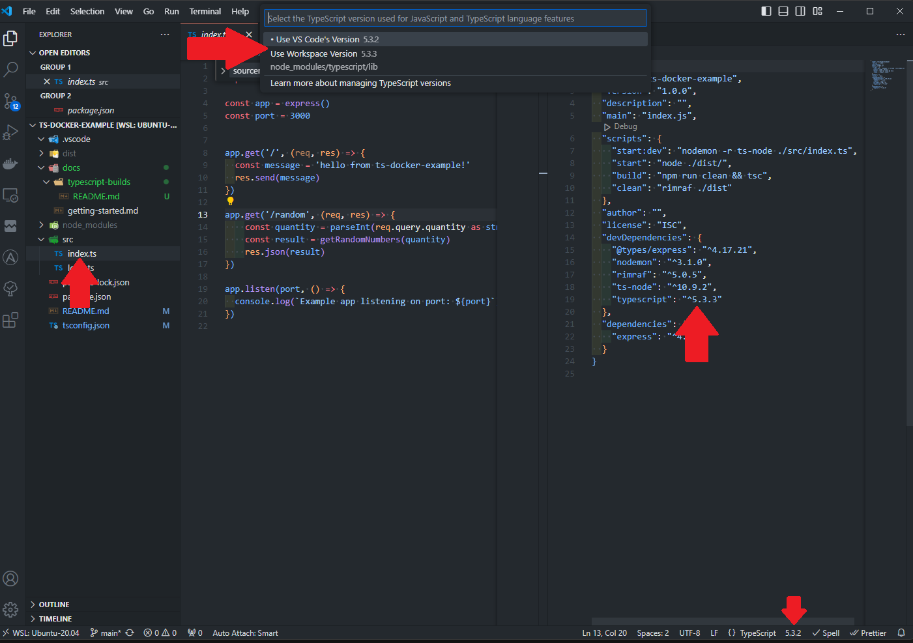
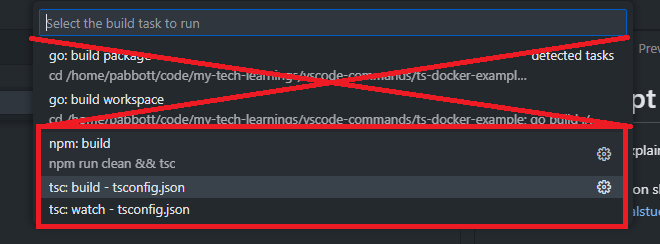
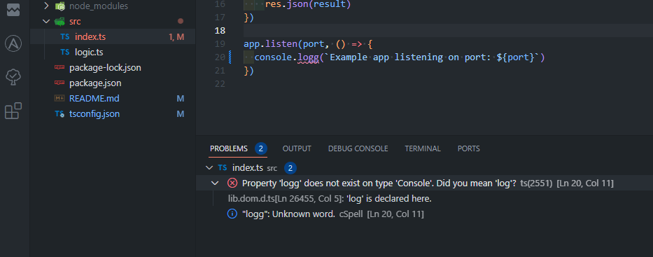

# Typescript Builds

This document explains how to integrate Typescript and the VS Code IDE.

This documentation shows the highlights from this guide as it pertains to this project as well as my reflections
https://code.visualstudio.com/docs/typescript/typescript-compiling

## Basic Setup

This project is configured with Typescript.  It is set up to enable the command `npm run build` which will output javascript files in a `./dist/` directory.  The compiler has also been set up to include source maps.


## Typescript Version
Note that the Typescript Version that VS Code uses might be different than what is defined in the project.  This can be changed by clicking on the version number with a typescript file open.  See image below.



Choosing the preference of using the workspace version will auto generate a new file `.vscode/settings.json` with the following content

```json
{
    "typescript.tsdk": "node_modules/typescript/lib"
}
```
ga
## Running & Configuring Builds

We can use VS Code to run a build with `CTRL+SHIFT+B` which will spawn a menu.

In my case, VS Code offered a few options for running builds.  I could use `tsc` to run a either a `build` or a `watch` which is cool.  It also found the `npm run build` configuration I had set up.  Strangely, it offered 2 go configurations which doesn't make sense.  Perhaps its because I have the VS Code GO extension installed?

In any case, here's what it looks like:



I really like having the `npm` `scripts` as the source of truth for project commands, so I'll configure the `npm:build` task by clicking the cog icon for that menu item.

This automatically generates another file called `.vscode/tasks.json` with the following content:

```json
{
	"version": "2.0.0",
	"tasks": [
		{
			"type": "npm",
			"script": "build",
			"group": "build",
			"problemMatcher": [],
			"label": "npm: build",
			"detail": "npm run clean && tsc"
		}
	]
}
```

## Set the default build task

It would be really nice to have the build task run every time I push `CTRL+SHIFT+B`.  To do this, we need to edit the `.vscode/tasks.json` file generated from earlier.

The easiest way to do this is to push `CTRL+SHIFT+P` for the VS Code command palette and then choose `Configure Default Build Task`.

This changes the `group` setting to be an object with `isDefault` set to `true`

```json
"group": {
    "kind": "build",
    "isDefault": true
},
```

## Reviewing Build Issues

With all of this configured, we can visualize any build issue by looking at the problems menu.  This can be brought up with `CTRL+SHIFT+M`  - `m` is the last letter of `problem` and could be a way to remember this shortcut.




